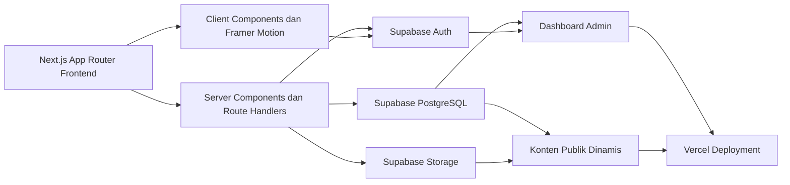
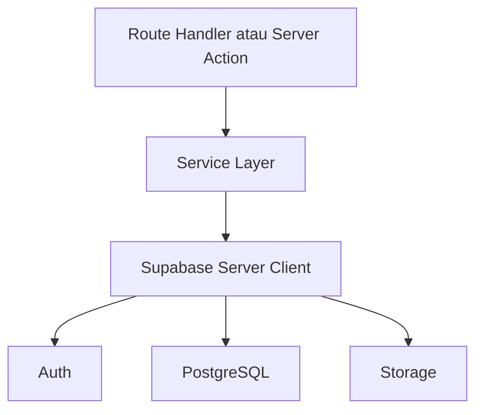

## 1. Desain Arsitektur


## 2. Deskripsi Teknologi
- Frontend: Next.js App Router + TypeScript + Tailwind CSS + Framer Motion
- UI Foundation: reusable components, utility-first styling, motion primitives, modular sections
- Backend: Next.js Server Actions atau Route Handlers terintegrasi dengan Supabase
- Authentication: Supabase Auth dengan email/password, forgot password, reset password, session management
- Database: Supabase PostgreSQL
- Storage: Supabase Storage untuk hero image, berita, wisata, galeri, dan foto pemerintahan
- Hosting: Vercel
- SEO: metadata App Router, Open Graph, robots, sitemap
- Keamanan: Row Level Security, protected admin routes, upload terbatas untuk admin terautentikasi

## 3. Definisi Rute
| Rute | Tujuan |
|------|--------|
| / | Landing page resmi Nagari Silongo dengan seluruh section publik |
| /profil | Profil lengkap nagari, geografi, jorong, fasilitas, identitas wilayah |
| /pemerintahan | Struktur pemerintahan dan detail perangkat nagari |
| /statistik | Statistik nagari dalam format visual dinamis |
| /wisata | Daftar wisata dan budaya |
| /wisata/[slug] | Detail wisata atau budaya |
| /berita | Daftar berita, kategori, pencarian |
| /berita/[slug] | Detail berita dinamis dengan metadata SEO |
| /galeri | Galeri premium dengan filter kategori |
| /kontak | Informasi kontak resmi dan peta |
| /admin/login | Halaman login admin berbasis Supabase Auth |
| /admin/forgot-password | Form lupa password |
| /admin/reset-password | Form reset password |
| /admin | Dashboard admin terlindungi |
| /admin/hero | Kelola hero |
| /admin/profil | Kelola profil |
| /admin/visi-misi | Kelola visi misi |
| /admin/statistik | Kelola statistik |
| /admin/berita | Kelola berita |
| /admin/galeri | Kelola galeri |
| /admin/wisata | Kelola wisata |
| /admin/pemerintahan | Kelola pemerintahan |
| /admin/kontak | Kelola kontak |
| /admin/footer | Kelola footer |

## 4. Definisi API
### 4.1 Tipe Data Inti
```ts
export type Hero = {
  id: string;
  badge: string;
  title: string;
  subtitle: string;
  slogan: string;
  primary_cta_label: string;
  primary_cta_href: string;
  secondary_cta_label: string;
  secondary_cta_href: string;
  background_image_url: string | null;
  updated_at: string;
};

export type Pemerintahan = {
  id: string;
  nama: string;
  jabatan: string;
  deskripsi: string | null;
  foto_url: string | null;
  urutan: number;
  status_aktif: boolean;
  created_at: string;
};

export type Berita = {
  id: string;
  title: string;
  slug: string;
  excerpt: string | null;
  content: string;
  thumbnail_url: string | null;
  category: string | null;
  is_featured: boolean;
  published_at: string;
  created_at: string;
};
```

### 4.2 Endpoint dan Aksi
| Endpoint / Aksi | Metode | Tujuan |
|-----------------|--------|--------|
| /api/public/home | GET | Mengambil agregasi data homepage |
| /api/public/berita | GET | Mengambil daftar berita publik dengan search dan kategori |
| /api/public/berita/[slug] | GET | Mengambil detail berita |
| /api/public/wisata | GET | Mengambil daftar wisata dan budaya |
| /api/public/galeri | GET | Mengambil daftar galeri |
| /api/admin/upload | POST | Upload gambar ke Supabase Storage, admin only |
| /api/admin/hero | PATCH | Memperbarui data hero, admin only |
| /api/admin/profil | PATCH | Memperbarui data profil, admin only |
| /api/admin/visi-misi | PATCH | Memperbarui visi dan misi, admin only |
| /api/admin/statistik | POST/PATCH/DELETE | CRUD statistik |
| /api/admin/berita | POST/PATCH/DELETE | CRUD berita |
| /api/admin/galeri | POST/PATCH/DELETE | CRUD galeri |
| /api/admin/wisata | POST/PATCH/DELETE | CRUD wisata |
| /api/admin/pemerintahan | GET/POST/PATCH/DELETE | Search, filter, pagination, CRUD pemerintahan |
| /api/admin/kontak | PATCH | Memperbarui kontak |
| /api/admin/footer | PATCH | Memperbarui footer |

## 5. Diagram Arsitektur Server


## 6. Model Data
### 6.1 Definisi Model Data

```mermaid
erDiagram
    hero {
        uuid id PK
        text badge
        text title
        text subtitle
        text slogan
        text primary_cta_label
        text primary_cta_href
        text secondary_cta_label
        text secondary_cta_href
        text background_image_url
        timestamptz updated_at
    }
    profil {
        uuid id PK
        text title
        text description
        text wilayah
        text jumlah_penduduk
        text jumlah_jorong
        text daftar_jorong_json
        text sungai_json
        text fasilitas_json
        text image_primary_url
        text image_secondary_url
        timestamptz updated_at
    }
    visi_misi {
        uuid id PK
        text visi
        jsonb misi
        timestamptz updated_at
    }
    statistik {
        uuid id PK
        text label
        text value
        text suffix
        text icon
        integer urutan
        boolean status_aktif
        timestamptz created_at
    }
    berita {
        uuid id PK
        text title
        text slug
        text excerpt
        text content
        text thumbnail_url
        text category
        boolean is_featured
        timestamptz published_at
        timestamptz created_at
    }
    galeri {
        uuid id PK
        text title
        text description
        text image_url
        text category
        integer urutan
        boolean status_aktif
        timestamptz created_at
    }
    wisata {
        uuid id PK
        text title
        text slug
        text description
        text image_url
        text category
        boolean status_aktif
        timestamptz created_at
    }
    kontak {
        uuid id PK
        text alamat
        text kode_pos
        text whatsapp
        text email
        text maps_embed
        text jam_layanan
        timestamptz updated_at
    }
    admin_settings {
        uuid id PK
        text footer_description
        text facebook
        text instagram
        text youtube
        text tiktok
        timestamptz updated_at
    }
    pemerintahan {
        uuid id PK
        text nama
        text jabatan
        text deskripsi
        text foto_url
        integer urutan
        boolean status_aktif
        timestamptz created_at
    }
```


### 6.2 Data Definition Language
```sql
create table if not exists hero (
  id uuid primary key default gen_random_uuid(),
  badge text not null default 'Website Resmi Pemerintahan Nagari',
  title text not null default 'NAGARI SILONGO',
  subtitle text not null,
  slogan text not null,
  primary_cta_label text not null default 'Jelajahi Nagari',
  primary_cta_href text not null default '#profil',
  secondary_cta_label text not null default 'Informasi Publik',
  secondary_cta_href text not null default '#berita',
  background_image_url text,
  updated_at timestamptz not null default now()
);

create table if not exists profil (
  id uuid primary key default gen_random_uuid(),
  title text not null default 'Tentang Nagari Silongo',
  description text not null,
  wilayah text not null default '13,40 km²',
  jumlah_penduduk text not null default '839',
  jumlah_jorong text not null default '3',
  daftar_jorong_json jsonb not null default '[]'::jsonb,
  sungai_json jsonb not null default '[]'::jsonb,
  fasilitas_json jsonb not null default '{}'::jsonb,
  image_primary_url text,
  image_secondary_url text,
  updated_at timestamptz not null default now()
);

create table if not exists visi_misi (
  id uuid primary key default gen_random_uuid(),
  visi text not null,
  misi jsonb not null default '[]'::jsonb,
  updated_at timestamptz not null default now()
);

create table if not exists statistik (
  id uuid primary key default gen_random_uuid(),
  label text not null,
  value text not null,
  suffix text,
  icon text,
  urutan integer not null default 0,
  status_aktif boolean not null default true,
  created_at timestamptz not null default now()
);

create table if not exists berita (
  id uuid primary key default gen_random_uuid(),
  title text not null,
  slug text not null unique,
  excerpt text,
  content text not null,
  thumbnail_url text,
  category text,
  is_featured boolean not null default false,
  published_at timestamptz not null default now(),
  created_at timestamptz not null default now()
);

create table if not exists galeri (
  id uuid primary key default gen_random_uuid(),
  title text,
  description text,
  image_url text not null,
  category text,
  urutan integer not null default 0,
  status_aktif boolean not null default true,
  created_at timestamptz not null default now()
);

create table if not exists wisata (
  id uuid primary key default gen_random_uuid(),
  title text not null,
  slug text not null unique,
  description text not null,
  image_url text,
  category text,
  status_aktif boolean not null default true,
  created_at timestamptz not null default now()
);

create table if not exists kontak (
  id uuid primary key default gen_random_uuid(),
  alamat text not null,
  kode_pos text not null,
  whatsapp text,
  email text,
  maps_embed text,
  jam_layanan text,
  updated_at timestamptz not null default now()
);

create table if not exists admin_settings (
  id uuid primary key default gen_random_uuid(),
  footer_description text,
  facebook text,
  instagram text,
  youtube text,
  tiktok text,
  updated_at timestamptz not null default now()
);

create table if not exists pemerintahan (
  id uuid primary key default gen_random_uuid(),
  nama text not null,
  jabatan text not null,
  deskripsi text,
  foto_url text,
  urutan integer not null default 0,
  status_aktif boolean not null default true,
  created_at timestamptz not null default now()
);
```

## 7. Keamanan dan Otorisasi
- Seluruh tabel publik dapat dibaca anonim hanya untuk data aktif dan data yang memang ditujukan ke frontend publik.
- Operasi create, update, delete dibatasi hanya untuk pengguna yang sudah login sebagai admin.
- Upload file dilakukan memakai Supabase Storage dengan validasi folder dan peran admin.
- Admin routes memakai middleware dan validasi session Supabase di server.
- Seluruh mutasi memakai server-side validation dengan Zod.

## 8. Strategi Implementasi
- Fase 1: restrukturisasi proyek dari basis existing ke arsitektur Supabase.
- Fase 2: bangun desain publik premium dengan section modular reusable.
- Fase 3: bangun auth dan dashboard admin penuh.
- Fase 4: integrasikan storage, SEO, sitemap, robots, dan optimasi deploy Vercel.
