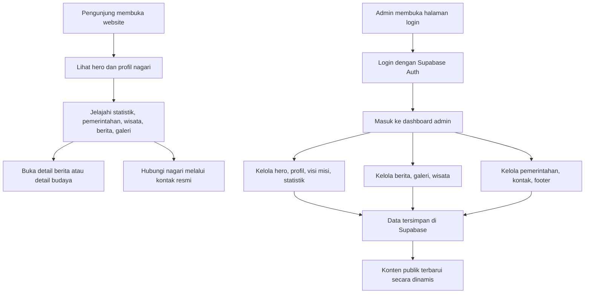

## 1. Gambaran Produk
Website resmi Nagari Silongo adalah portal pemerintahan digital premium yang menggabungkan citra modern, identitas Minangkabau, layanan informasi publik, dan dashboard admin yang sepenuhnya dinamis.
- Produk melayani masyarakat, perangkat nagari, dan calon pengunjung melalui pengalaman web yang profesional, cepat, responsif, dan siap dipakai di dunia nyata.
- Nilai produk terletak pada peningkatan kepercayaan publik, kemudahan pengelolaan konten, dan transformasi citra pemerintahan nagari menjadi modern serta transparan.

## 2. Fitur Inti

### 2.1 Peran Pengguna
| Peran | Metode Akses | Hak Akses Inti |
|------|--------------|----------------|
| Pengunjung Publik | Tanpa login | Melihat seluruh konten publik, berita, wisata, galeri, statistik, profil, dan kontak |
| Admin Nagari | Supabase Auth email dan password | Login, logout, reset password, mengelola seluruh konten CMS, mengunggah media, dan mengatur tampilan data |

### 2.2 Modul Fitur
1. **Beranda**: hero cinematic, statistik, profil singkat, visi misi, pemerintahan, wisata budaya, berita, galeri, kontak.
2. **Profil Nagari**: profil lengkap, geografi, jorong, sungai, fasilitas, jarak strategis, identitas nagari.
3. **Pemerintahan**: struktur pemerintahan, detail perangkat, status aktif, urutan tampil, modal detail.
4. **Statistik**: penduduk, jorong, luas wilayah, rumah ibadah, UMKM, indikator penting.
5. **Wisata dan Budaya**: budaya Minangkabau, Rumah Gadang, adat, kuliner, potensi alam, detail konten dinamis.
6. **Berita**: featured news, daftar berita terbaru, kategori, pencarian, halaman detail dinamis.
7. **Galeri**: masonry grid, lightbox, lazy loading, kategorisasi media.
8. **Kontak**: alamat, peta, WhatsApp, email, jam layanan, informasi resmi.
9. **Login Admin**: autentikasi aman dengan Supabase Auth, forgot password, reset password, proteksi sesi.
10. **Dashboard Admin**: overview konten, navigasi CMS, pengelolaan data tiap modul, upload gambar ke Supabase Storage.
11. **Kelola Pemerintahan**: tabel modern, pencarian, filter jabatan, pagination, tambah-edit-hapus, preview foto, urutan tampil, aktif/nonaktif.

### 2.3 Rincian Halaman
| Nama Halaman | Nama Modul | Deskripsi Fitur |
|--------------|------------|-----------------|
| Beranda | Navbar | Sticky glass navbar, blur, animasi hover, hamburger modern, shortcut login admin |
| Beranda | Hero | Latar Rumah Gadang modern, animated overlay, particles halus, parallax ringan, CTA, slogan, counter statistik |
| Beranda | Tentang Nagari | Split layout, image collage, kartu informasi jorong, sungai, fasilitas, reveal animation |
| Beranda | Visi Misi | Kartu premium dengan ikon, hover glow, animasi stagger |
| Beranda | Statistik | Counter animasi, glass card, hover, glow, indikator utama nagari |
| Beranda | Pemerintahan | Grid premium pejabat, modal detail, status aktif, urutan dinamis |
| Beranda | Wisata dan Budaya | Kartu sinematik, modal detail, kategori budaya dan alam |
| Beranda | Berita | Berita unggulan, grid berita terbaru, kategori, pencarian cepat |
| Beranda | Galeri | Masonry premium, lazy load, lightbox popup, hover cinematic |
| Beranda | Kontak | Detail alamat, embed peta, WhatsApp, email, jam layanan |
| Berita | Listing Berita | Pencarian, filter kategori, featured card, pagination atau load more |
| Berita | Detail Berita | Thumbnail, metadata, konten rich text, berita terkait, metadata dinamis |
| Admin Login | Form Auth | Login, forgot password, reset password, session persistence |
| Dashboard Admin | Overview | Ringkasan data, akses cepat ke modul, indikator total konten |
| Dashboard Admin | Kelola Hero | Edit badge, judul, subtitle, slogan, CTA, gambar hero |
| Dashboard Admin | Kelola Profil | Edit profil nagari, deskripsi, gambar, data identitas |
| Dashboard Admin | Kelola Visi Misi | Edit visi dan daftar misi |
| Dashboard Admin | Kelola Statistik | Tambah, edit, hapus statistik |
| Dashboard Admin | Kelola Berita | CRUD berita, upload thumbnail, featured, kategori, slug |
| Dashboard Admin | Kelola Galeri | CRUD galeri, upload foto, kategori |
| Dashboard Admin | Kelola Wisata | CRUD wisata budaya, upload foto, kategori |
| Dashboard Admin | Kelola Pemerintahan | Tabel modern, search, filter, pagination, modal form, upload foto, aktif/nonaktif, urutan |
| Dashboard Admin | Kelola Kontak | Edit alamat, peta, WhatsApp, email, jam pelayanan |
| Dashboard Admin | Kelola Footer | Edit deskripsi singkat, tautan, identitas footer |

## 3. Proses Inti
Pengunjung masuk ke situs, melihat identitas Nagari Silongo, menelusuri informasi publik, membaca berita, melihat galeri dan wisata, lalu menghubungi kantor nagari melalui kanal resmi. Admin login lewat Supabase Auth, masuk ke dashboard terlindungi, mengelola konten, mengunggah media, dan perubahan langsung tampil pada situs publik.

## 4. Desain Antarmuka
### 4.1 Gaya Desain
- Arah visual: portal pemerintahan premium dengan rasa Apple-style, SaaS modern, dan sentuhan adat Minangkabau kontemporer.
- Warna utama: biru elegan, emas lembut, hijau natural dengan gradient sinematik dan soft glow.
- Bentuk komponen: rounded premium, glassmorphism, shadow lembut, border transparan, efek blur terukur.
- Tipografi: display font berkarakter untuk judul besar dan sans modern premium untuk isi teks dengan hirarki tegas.
- Tata letak: desktop-first, grid modular, section sinematik, ruang napas luas, susunan elemen bersih dan mewah.
- Gaya ikon: outline modern, konsisten, bernuansa pemerintahan digital.
- Motion: reveal on scroll, stagger animation, floating elemen, modal halus, hover transisi premium, parallax ringan.

### 4.2 Ringkasan Desain Per Halaman
| Nama Halaman | Nama Modul | Elemen UI |
|--------------|------------|-----------|
| Beranda | Hero | Fullscreen cinematic, background image premium, overlay gradient, CTA kontras, stat cards melayang |
| Beranda | Tentang | Split content, kolase foto, glass cards, accent lines, reveal stagger |
| Beranda | Statistik | Grid glow cards, angka besar, badge informasi, efek hover |
| Beranda | Pemerintahan | Card portrait premium, badge jabatan, modal detail, filter visual lembut |
| Beranda | Wisata dan Budaya | Image cards sinematik, hover zoom, overlay teks, modal detail |
| Beranda | Berita | Featured editorial card, card grid modern, chip kategori, search bar premium |
| Beranda | Galeri | Masonry gallery, cinematic overlay, lightbox bersih |
| Admin Login | Auth Panel | Glassmorphism penuh, latar gradient, form modern, feedback validasi jelas |
| Dashboard Admin | Layout | Sidebar modern, topbar ringan, card statistik, tabel profesional |
| Kelola Pemerintahan | Tabel dan Modal | Search field, filter dropdown, table, avatar preview, modal form, dialog konfirmasi |

### 4.3 Responsivitas
- Pendekatan desktop-first dengan adaptasi mobile yang tetap premium.
- Navbar berubah menjadi mobile menu modern dengan animasi halus.
- Grid konten turun bertahap ke 2 kolom lalu 1 kolom tanpa merusak hierarki visual.
- Seluruh komponen interaktif ramah sentuh, termasuk lightbox, modal, dan tombol aksi admin.
- Gambar menggunakan rasio responsif dan optimasi ukuran untuk berbagai breakpoint.
